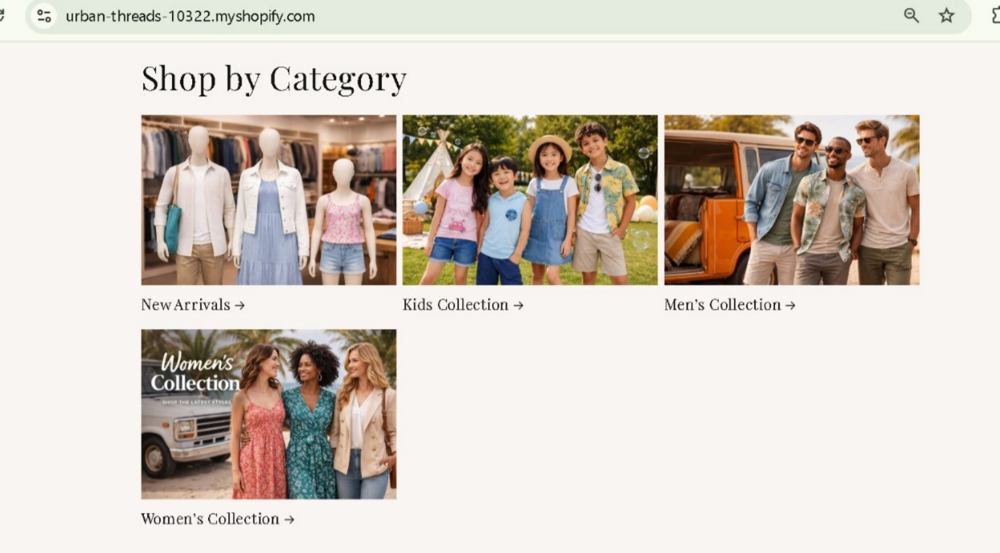
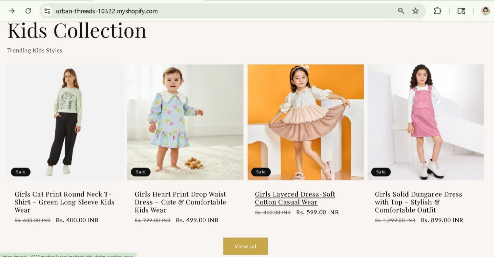
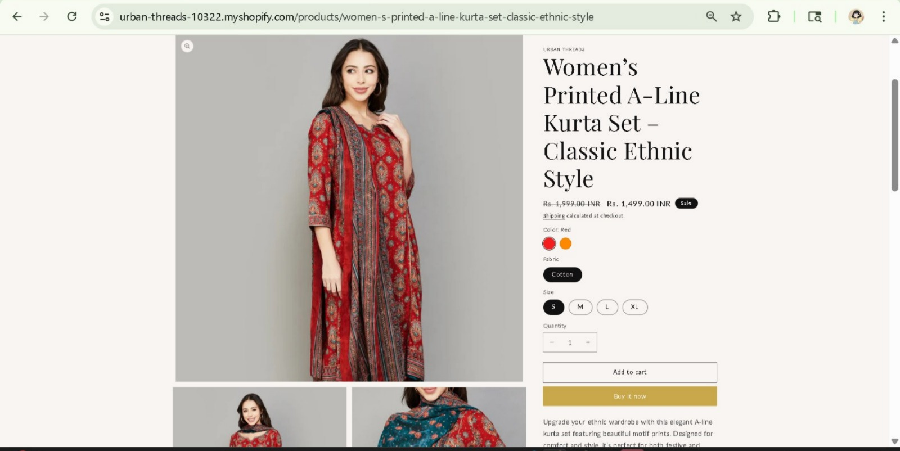
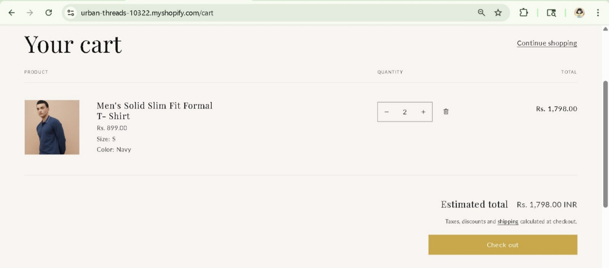

🛍️ Shopify E-commerce Store – Urban Threads

📌 Project Overview:
This project is a fully functional e-commerce website built using Shopify (Dawn Theme). It represents a modern fashion store with well-structured product listings, collections, and a user-friendly shopping experience.

## 🚀 Features

- 🏠 Responsive homepage with a proportional promotional banner  
- 🎯 Trend-focused sections showcasing latest fashion styles  
- 🛍️ Product pages with detailed descriptions, pricing, and variants (size, color, fabric)  
- 📂 Well-organized collections (Men, Women, Kids, New Arrivals)  
- 🔍 Easy navigation with dropdown menus  
- 🛒 Cart page for order review and quantity management  
- 💳 Cash on Delivery (COD) payment option enabled  
- 💰 Discount pricing using “compare at price” feature  
- 📱 Fully mobile-responsive and user-friendly design
    
## 🛠 Tech Stack

- 🛍️ Shopify (Dawn Theme)  
- 💧 Liquid (Shopify templating language)  
- 🌐 HTML5  
- 🎨 CSS3 (Theme customization)
 
## 🌐 Live Store

- 🔗 **Store Link:**(https://urban-threads-10322.myshopify.com)  
- 🔐 **Password:** Test@123

## 📸 Screenshots

### 🏠 Homepage

 

### 🛍 Category Page

 

### 👶 Collection Page

 

### 👗 Product Page

 

### 🛒 Cart Page

 

📖 What I Learned
Creating and managing products with variants (size, color, fabric)
Implementing structured SKU systems for inventory management
Organizing collections and navigation menus
Designing responsive and user-friendly layouts
Understanding real-world e-commerce store setup using Shopify

🎯 Conclusion

This project provided hands-on experience in building and managing a real-world e-commerce store using Shopify. It enhanced my understanding of product management, UI/UX design, and online store optimization.

